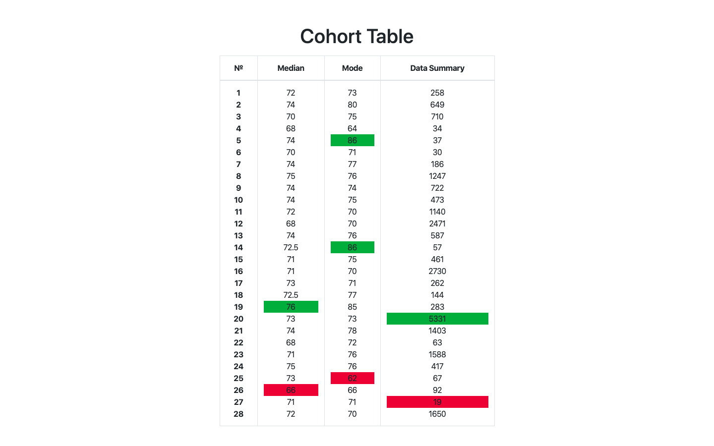

# Table of Cohort Analysis

## Description
Table of cohort analysis is one of a method for data analysis used 
at Big Data Science. The feature creates the table with data 
and searches in data maximum and minimum values. The feature 
marks maximum values by green color and minimum values by red 
color.

## Table's Example

